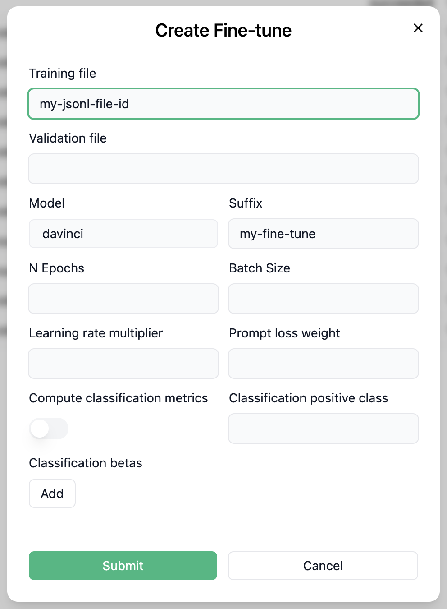

# Bot Studio

## What’s Bot studio

We have been using OpenAI GPT API to build chatbots for our clients, yet we found the model testing process could be more interactive and visualized, so we developed [bot-studio.com](http://bot-studio.com/), an open sourced dashboard to test your models with a chat interface.

## Why it’s useful

A real chat interface is simply much better than a python IDE when testing your model.

## Get started

Now we only support OpenAI GPT APIs. To get started, all you need is to fill our your org name, org key and API key, you can find your org key here:

[https://platform.openai.com/account/org-settings](https://platform.openai.com/account/org-settings)

We do not use any of your data mentioned above outside of this app.

